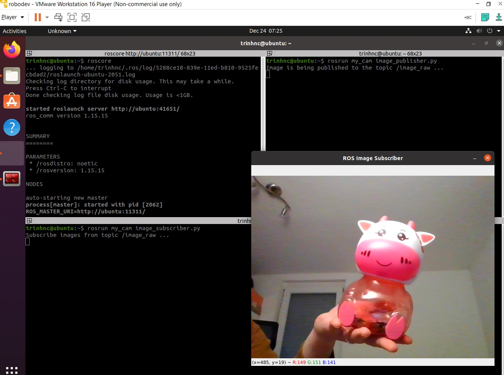

# my_cam
A ROS package to publish and subscribe images from USB (or integrated) webcam.

This package is from Chapter 7 and 8 of [ROS 101 series](https://robodev.blog/series/ros101) on my blog [robodev.blog](https://robodev.blog).
Follow the instruction in the tutorials to better understand and run the code. Below are the main commands.

## Run the image publisher
First, check the camera name by using this command:
`ls -ltrh /dev/video*`. In my case, it is `/dev/video0` which is the integrated webcam of my laptop.

Start a ROS Master by the following command:

`roscore`

There are two way to run the publisher: 

`rosrun my_cam image_publisher.py` 

or 

`roslaunch my_cam my_cam.launch`.

If you use `rosrun`, you should adjust the camera name from the line 13: `capture = cv2.VideoCapture("/dev/video0")` in _image_publisher.py_. If you use `roslaunch`, change it in the second line of _launch/mycam.launch_:  `<arg name="camera_name" default="/dev/video0"/>`.

## Run the image subscriber
If your subscribed topic has a different name than `image_raw`, you should change it in line 26: `image_subcriber = rospy.Subscriber("image_raw", Image, callback)` of _image_subscriber.py_. Then run:

`rosrun my_cam image_subscriber.py`

After that, you should see a window with the title _ROS Image Subscriber_ showing your webcam view like what I have in the photo below.

